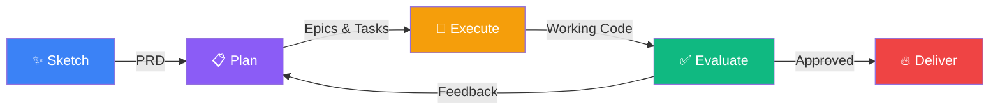

# Lord of the Sprints

**The Fellowship of AI agent — plan and build software at the speed of thought, and never pay for SaaS again.**

[](LICENSE)
[](https://nodejs.org/)
[](https://www.typescriptlang.org/)
[](CONTRIBUTING.md)

<p align="center">
  
</p>

Tired of _managing AI_ and just want to _build good software_? Lord of the Sprints guides you across five phases of product development — SPEED: **Sketch**, **Plan**, **Execute**, **Evaluate**, and **Deliver** — to transform a high-level product idea into well-architected, working software with minimal manual intervention. The built-in AI orchestration layer manages a whole fellowship of agents, from visionary product sages who help you write PRDs, to coders and QA to forge and test your software.

Even the smallest developer can ship great software. But they shouldn't have to do it alone.

## Why Lord of the Sprints?

Building software with AI today is **fragmented and unstructured**. Developers use AI coding assistants for individual tasks, but there is no cohesive system that manages the full journey from idea to deployed product — like setting out for Mordor without a map, a fellowship, or a plan. This leads to:

- **No architectural coherence** — AI-generated code lacks a unified vision because each prompt is handled in isolation
- **Manual orchestration overhead** — users spend time managing prompts, context windows, and task sequencing instead of making product decisions
- **No feedback loop** — there is no structured way to validate completed work and feed findings back into development
- **Tooling headaches** — using advanced AI tools currently requires deep technical familiarity with terminal commands, preventing ordinary people from participating in their full power

Lord of the Sprints solves this with a Product-Driven web UI that maintains context across the entire lifecycle and automates the orchestration of agents. Humans focus on _what_ to build and _why_; the Fellowship handles _how_.

> _"The board is set. The pieces are moving."_

### What about Gas Town?

You've probably heard about [Gas Town](https://github.com/steveyegge/gastown), the original AI orchestrator.

Lord of the Sprints takes the concept of an AI orchestrator and levels it up: now you're not working in terminals giving text-only prompts and trying to keep track of agents across the plains of Gorgoroth — you're working in a web-first workflow that gives Jira a run for its money. Brainstorm your PRD alongside an agent in a Google Docs-like interface. Track project status and provide feedback (including wonderful web features like attaching screenshots and replying inline). Once your fellowship sets out, the journey has only one end.

## Quick Start

```bash
git clone https://github.com/toddmedema/lordofthesprints.git
cd lordofthesprints
npm install
npm run dev
```

Then open your browser to http://localhost:5173 and begin your quest!

### Integrations

To assemble your fellowship of AI agents, you'll need at least one existing agent subscription and API key. The orchestration layer is designed to work on top of any AI agent that can read prompts and return outputs, so it's BYO-AI — bring your own wizard.

We currently natively support Claude and Cursor APIs, as well as custom APIs via inputting your own CLI command that calls the agents. Please open an issue if you'd like native support for other AI providers!

## The SPEED Quest



| Phase        | What happens                                                                     |
| ------------ | -------------------------------------------------------------------------------- |
| **Sketch**   | Chat with AI to refine your idea into a structured Product Requirements Document |
| **Plan**     | AI decomposes the PRD into epics, tasks, and a dependency graph                  |
| **Execute**  | AI agents autonomously execute tasks with two-agent code + review cycles         |
| **Evaluate** | Submit feedback that AI categorizes and maps back to plan epics for iteration    |
| **Deliver**  | Ship your code and deliver value to the free peoples of the world!               |

## The Fellowship

Lord of the Sprints orchestrates a fellowship of nine specialized agents — each responsible for a distinct part of the SPEED quest. They have been chosen carefully, for each possesses a unique skill that the others do not.

<table>
<thead>
<tr>
  <th colspan="2">Fellowship Member</th>
  <th>Phase</th>
  <th>Description</th>
</tr>
</thead>
<tbody>
<tr>
  <td></td>
  <td><strong>Gandalf</strong><br>Dreamer</td>
  <td>Sketch</td>
  <td>The wise conversationalist who refines your idea into a PRD, asking the hard questions and challenging assumptions before the journey begins. <em>You shall not ship without a plan.</em></td>
</tr>
<tr>
  <td></td>
  <td><strong>Aragorn</strong><br>Planner</td>
  <td>Plan</td>
  <td>The brilliant strategist who decomposes a PRD into epics, tasks, and a dependency graph — knowing every milestone and danger on the road ahead.</td>
</tr>
<tr>
  <td></td>
  <td><strong>Frodo</strong><br>Harmonizer</td>
  <td>All</td>
  <td>The steady keeper of the central mission, quietly ensuring the PRD stays true even as implementation forces difficult compromises. The Ringbearer of product vision.</td>
</tr>
<tr>
  <td></td>
  <td><strong>Legolas</strong><br>Analyst</td>
  <td>Evaluate</td>
  <td>With eyes that miss nothing, categorizes every piece of user feedback and maps it to the right epic before anyone else has processed it.</td>
</tr>
<tr>
  <td></td>
  <td><strong>Samwise</strong><br>Summarizer</td>
  <td>Execute</td>
  <td>Ever-faithful and efficient, distills assembled context down to exactly what the Coder needs — nothing more, nothing less. <em>I can't carry the context for you, but I can carry it.</em></td>
</tr>
<tr>
  <td></td>
  <td><strong>Gimli</strong><br>Auditor</td>
  <td>Execute</td>
  <td>Surveys what has <em>actually</em> been built with unflinching honesty, then determines exactly — and only — what still needs doing.</td>
</tr>
<tr>
  <td></td>
  <td><strong>Pippin</strong><br>Coder</td>
  <td>Execute</td>
  <td>Full of energy and occasionally chaotic, dives into every task head-first and always ships working code with tests.</td>
</tr>
<tr>
  <td></td>
  <td><strong>Boromir</strong><br>Reviewer</td>
  <td>Execute</td>
  <td>Principled and demanding, validates every implementation against its acceptance criteria — approving only what truly serves the cause.</td>
</tr>
<tr>
  <td></td>
  <td><strong>Merry</strong><br>Merger</td>
  <td>Execute</td>
  <td>Clever and unflappable, steps in when rebase conflicts block the road, resolves the mess with quiet competence, and keeps the journey moving.</td>
</tr>
</tbody>
</table>

## Project Structure

```
lordofthesprints/
├── packages/
│   ├── backend/    # Node.js + Express API server (TypeScript)
│   ├── frontend/   # React + Vite application (TypeScript, Tailwind CSS)
│   └── shared/     # Shared types and constants
├── .beads/         # Git-based issue tracker data
├── PRD.md          # Product Requirements Document
└── package.json    # Root workspace config (npm workspaces)
```

## Scripts

All scripts can be run from the project root:

| Command         | Description                                      |
| --------------- | ------------------------------------------------ |
| `npm run dev`   | Start backend + frontend concurrently            |
| `npm run build` | Build all packages (shared → backend → frontend) |
| `npm run test`  | Run tests across all packages                    |
| `npm run lint`  | Lint all packages                                |
| `npm run clean` | Remove all build artifacts and node_modules      |

## Tech Stack

| Layer              | Technologies                                                            |
| ------------------ | ----------------------------------------------------------------------- |
| **Backend**        | Node.js, Express, WebSocket (ws), TypeScript, Vitest                    |
| **Frontend**       | React 19, React Router, Vite, Tailwind CSS, TypeScript                  |
| **Shared**         | TypeScript types and constants consumed by both packages                |
| **Issue Tracking** | [Beads](https://github.com/toddmedema/beads) — git-native issue tracker |

## Prerequisites

- [Node.js](https://nodejs.org/) >= 20.0.0
- npm (included with Node.js)
- Git

## Environment Variables

| Variable                           | Default | Description                                                                                                                                                                         |
| ---------------------------------- | ------- | ----------------------------------------------------------------------------------------------------------------------------------------------------------------------------------- |
| `ANTHROPIC_API_KEY`                | —       | API key for Claude agent integration                                                                                                                                                |
| `CURSOR_API_KEY`                   | —       | API key for Cursor agent integration                                                                                                                                                |
| `PORT`                             | `3100`  | Backend server port                                                                                                                                                                 |
| `LORDOFTHESPRINTS_PRESERVE_AGENTS` | unset   | When set to `1`, agent processes survive backend restarts. Automatically set in `npm run dev` so that `tsx watch` restarts don't kill running agents. Do **not** set in production. |

## Developing on Lord of the Sprints

When using Lord of the Sprints to develop _itself_, you should use two separate clones to avoid contention between the running server and the AI agents modifying code — much like keeping the One Ring away from the Eye of Sauron while still making use of its power:

- **Control clone** — runs the backend/frontend server (`npm run dev`)
- **Dev clone** — the target repo where the orchestrator and AI agents make changes

This prevents `tsx watch` from restarting the server when agents commit code, and avoids git lock contention between your manual operations and the orchestrator's worktree management.

### Setup

```bash
# 1. Clone a second copy as the development target
git clone <your-origin-url> ~/lordofthesprints-dev
cd ~/lordofthesprints-dev && npm install

# 2. Copy project state from the control clone
cp -r /path/to/control-clone/.lordofthesprints ~/lordofthesprints-dev/.lordofthesprints
cp /path/to/control-clone/.env ~/lordofthesprints-dev/.env

# 3. Update the project's repoPath (via API or direct edit)
#    Option A — API (while server is running):
curl -X PUT http://localhost:3100/api/v1/projects/<PROJECT_ID> \
  -H 'Content-Type: application/json' \
  -d '{"repoPath": "/Users/you/lordofthesprints-dev"}'

#    Option B — edit ~/.lordofthesprints/projects.json directly
```

### Daily Workflow

- Run `npm run dev` from the **control clone** only
- The orchestrator creates git worktrees from the **dev clone** and runs agents there
- Run `bd` commands from `~/lordofthesprints-dev` (that's where `.beads/` lives)
- After agents push changes, `git pull` in the control clone to pick them up

## Contributing

All members of the fellowship are welcome! Whether it's a bug report, feature request, or pull request — all input is appreciated. Even the smallest contribution can change the course of the future.

1. **Fork** the repository
2. **Create a branch** for your feature or fix: `git checkout -b my-feature`
3. **Make your changes** and add tests where appropriate
4. **Run the test suite**: `npm test`
5. **Submit a pull request**

### Issue Tracking with Beads

This project uses [Beads](https://github.com/toddmedema/beads) (`bd`) for task and issue tracking. Run `bd onboard` to get started, then `bd ready` to find available work.

### Reporting Bugs

Open a [GitHub Issue](https://github.com/toddmedema/lordofthesprints/issues) with:

- Steps to reproduce
- Expected vs actual behavior
- Environment details (OS, Node version, browser)

## License

This project is licensed under the [GNU Affero General Public License v3.0](LICENSE) — you are free to use, modify, and distribute it, but derivative works must remain open source under the same license.

---

_"The greatest adventure is what lies ahead."_
